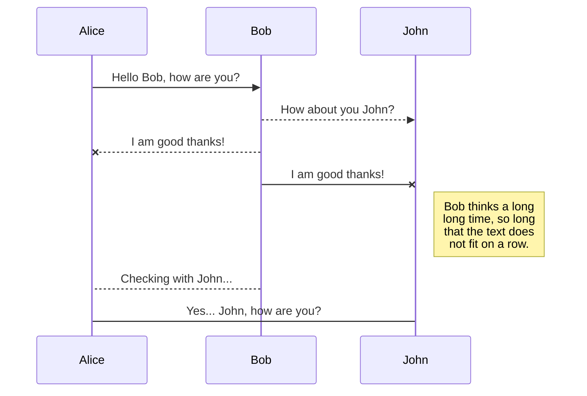

+++
id = "test"
title = "Test Article"
excerpt = "Article test content."
date = "2022-02-15T16:00:00+01:00"
draft = true
template = "post.html"
+++

Let's go!

# Heading 1

Footnote?[^1]

## Subheading 2

### Subheading 3

<aside>
<p>Your aside content goes here.</p>
</aside>

#### Subheading 4

##### Subheading 5

This is `code`.

And a code[^1][^2] block:

```rust
#[tokio::main]
async fn main() {
    env_logger::init();

    if let Err(e) = try_main().await {
        error!("{}", e);
        std::process::exit(1);
    }
}
```

###### Subheading 6



More text

Sources:

[^1]: <https://example.com/>

[^2]: Anekdote
